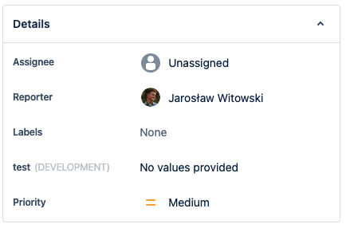
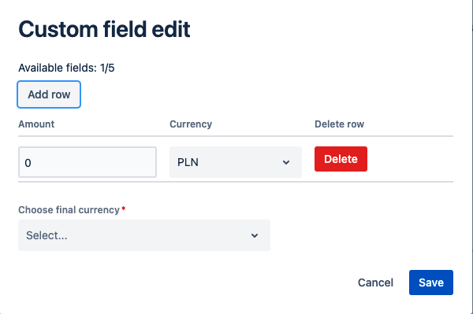

# Currency Exchange

 
## Description

**IMPORTANT❗
This app can only be used in Jira company-managed projects.**

The application provides an additional field in the issue for currency conversion. It is possible to convert multiple currencies simultaneously. 

The application is based on a reusable customFieldType. The application uses object type, config context and forge storage.

## Requirements

See [Getting Started](https://developer.atlassian.com/platform/forge/getting-started/) for instructions to get set up.
## Quick start

Once you have logged into the CLI (`forge login`), follow the steps below to install the app onto your site:

1. Clone this repository
2. Run `forge register` to register a new copy of this app to your developer account
3. Run `npm install` to install your dependencies
4. Run `forge deploy` to deploy the app into the default environment
5. Run `forge install` and follow the prompts to install the app

## Setup

### Create Custom Field. 

1. From the JIRA projects go into settings in the right-up corner.
2. Go into Issues menu. 

3. Select "Custom fields" from the menu on the left in the "Fields" category.
4. Click "Create custom field" button.
5. Select a field type "Currency Exchange".

6. Name Your field and click "Create".
7. Associate field to screens of Your choice and click "Update" to save changes.

### Setup context configuration (optional)

1. Go to the "Custom Fields" list from point 3 of previous instruction. 
2. Search added custom Field by name given in the point 6 of previous instruction. 
3. Click setting button on the right.
4. Choose contexts and default value.

5. Click edit Default Value or Edit Context Value.
6. Put necessary data and save changes.

## Usage

### Currency exchange

1. Custom field should be visible in the issue view. Providing data is also possible from the create issue panel view.

2. Click the field to open edit window.

3. Put required data: amount of cash, currency and target currency.
To put another currency simply click "Add row +" buttom. Reset will bring amount of currencies back to 1.
4. After saving the result of calculation will be visible in the issue panel.

## Documentation

### The app's [manifest.yml](./manifest.yml) is based on one module: 

1. A [jira:customFieldType module](https://developer.atlassian.com/platform/forge/manifest-reference/modules/#jira-custom-field-type--beta-) lets you create a new custom field type in Jira. Based on that you can craete new custom fields.
2. Data structure used in the app is based on object data type provided by [jira:customField](https://developer.atlassian.com/platform/forge/manifest-reference/modules/#jira-custom-field--beta-_). Manifest contains *schema* and *formatter* from customField.
3. A corresponding [function module](https://developer.atlassian.com/platform/forge/manifest-reference/#function)
that implements the app context configuration.

### Project structure

* [src](.src) - main folder containing all the code
* [src/utils/utils.ts](.src/utils/utils.ts) - folder containing addicional funcions
* [src/components](.src/components) - folder containing all the independent elements of the app
* * [src/components/View.jsx](.src/components/View.jsx) - responsible for displaying field in the issue view
* * [src/components/Select.jsx](.src/components/Select.jsx) - dropdown element for choosing the currency 
* * [src/components/Edit.jsx](.src/components/Edit.jsx) - based on customFieldEdit. Edits customField data.
* * [src/components/Table.jsx](.src/components/Table.jsx) - based on Table from ForgeUI. Display table element with inputs and addicional options.
* * [src/components/ConfigureContext.jsx](.src/components/ConfigureContext.jsx) - contains config context window
* [src/index.jsx](./src/index.jsx) - contains the main logic and UI elements of the app.
* [src/data/data.ts](./src/data/data.ts) - contains default configurations (default edit, view settings, placeholders etc.)

## Modules used in the app

- [`CustomField`](https://developer.atlassian.com/platform/forge/ui-kit-components/custom-field/) component
- [`CustomFieldEdit`](https://developer.atlassian.com/platform/forge/ui-kit-components/custom-field-edit/) component
- [`Button`](https://developer.atlassian.com/platform/forge/ui-components/button) component
- [`Fragment`](https://developer.atlassian.com/platform/forge/ui-kit-components/fragment/) component
- [`Text`](https://developer.atlassian.com/platform/forge/ui-components/text) component
- [`Table`](https://developer.atlassian.com/platform/forge/ui-components/table) component
- [`useState`](https://developer.atlassian.com/platform/forge/ui-hooks-reference/#usestate)
- [`useProductContext`](https://developer.atlassian.com/platform/forge/ui-hooks-reference/#useproductcontext)

The app uses the [storage api](https://developer.atlassian.com/platform/forge/runtime-reference/storage-api/) to store app configuration.

## Contributions

Contributions to Currency Exchange are welcome! Please see [CONTRIBUTING.md](CONTRIBUTING.md) for details.

## License

Copyright (c) 2021 Atlassian and others.
Apache 2.0 licensed, see [LICENSE](LICENSE) file.
